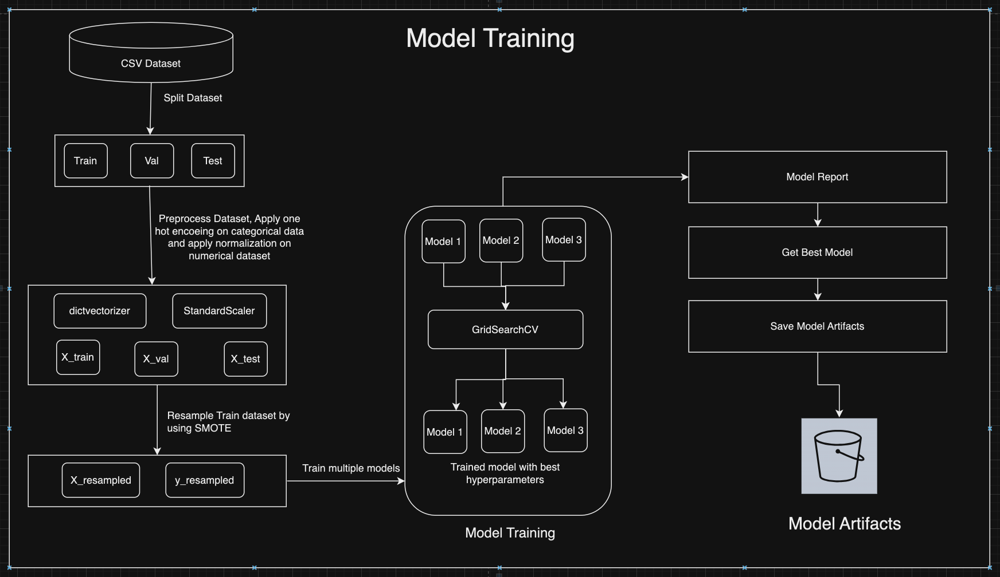
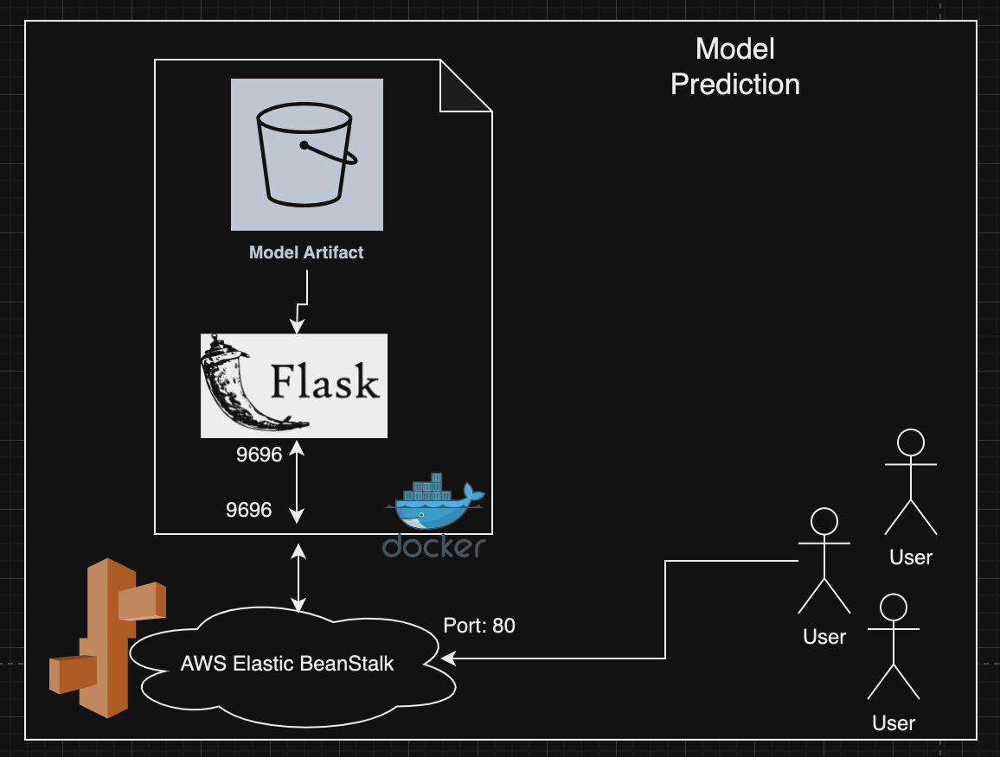
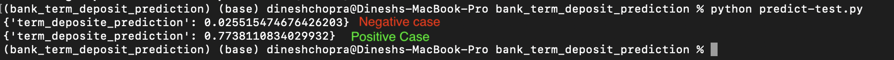
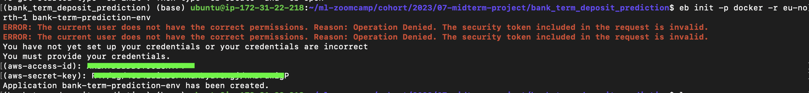

# Predict Term Deposit [Kaggle Link](https://www.kaggle.com/datasets/aslanahmedov/predict-term-deposit)


## Table of Contents:
1. [Problem description](#1-problem-description)
2. [Explore dataset Analysis EDA](#2-eda-notebook)
3. [Model training](#3-model-training-notebook)
4. [Exporting notebook to script](#4-exporting-notebook-to-script)
5. [Reproducibility](#5-reproducibility)
6. [Model deployment](#6-model-deployment)
7. [Dpendency and enviroment management](#7-dependency-and-enviroment-management)
8. [Containerization](#8-containerization)
9. [Cloud deployment](#9-cloud-deployment-ref)

## 1. Problem description
Bank has multiple banking products that it sells to customer such as saving account, credit cards, investments etc. It wants to which customer will purchase its credit cards. For the same it has various kind of information regarding the demographic details of the customer, their banking behavior etc. Once it can predict the chances that customer will purchase a product, it wants to use the same to make pre-payment to the authors.

In this part I will demonstrate how to build a model, to predict which clients will subscribing to a `Term Deposit`, with inception of machine learning. 

In the first part we will deal with the description and visualization of the analysed data, and in the second we will go to data classification models.

This dataset contains demographic and banking information about customers and also the outcome of the campaign, i.e. whether they subscribed to the product after the campaign or not. 

In this project, we want to train a model on this dataset in order to predict whether after a targeted campaign, a particular customer will subscribed to the product 'term deposit' or not. Since we want our model to predict yes or no, this is a binary classification problem.

## Model Training



## Model prediction/deployment



## 2. EDA [notebook](./notebook_eda.ipynb)
  * [Kaggle Dataset](https://www.kaggle.com/datasets/aslanahmedov/predict-term-deposit)
  * [wget link](https://raw.githubusercontent.com/DineshChopra/ml-zoomcamp/main/cohort/2023/07-midterm-project/bank_term_deposit_prediction/data/Assignment-2_Data.csv)

  ```bash
  !wget https://raw.githubusercontent.com/DineshChopra/ml-zoomcamp/main/cohort/2023/07-midterm-project/bank_term_deposit_prediction/data/Assignment-2_Data.csv
  ```

  * This dataset contains `45211` records with `18` features. Feature details are as Id,	age, job,	marital,	education,	default,	balance,	housing,	loan,	contact,	day,	month,	duration,	campaign,	pdays,	previous,	poutcome,	y,
  * Here `y` is the target label and rest are the dependent features.

  * Read dataset
  * Identify outliers in `age` and remove it
  * Handle null values
  * Understand `age` distribution
  * Understand `job` distrubution
  * Analyze `marital`
  * Analyze `education`
  * Analyze `default`
  * Analyze relationship between `age` and `balance`
  * Understand relationship between `age` and `loan`

## 3. Model training [notebook](./notebook_model_training.ipynb)

  * Import required Libraries
  * Read dataset
  * Split Dataframe into `train`, `val` and `test` sets by using `train_test_split` method of `sklearn.model_selection`
  * Preprocess dataset
    * Convert dataframe into dict
    * Apply one hot coding by using  `DictVectorizer`
    * Apply normalization by using `StandardScaler`
  * Resample train dataset
    * As our data set is unbalnced dataset, so to make it balance we can use `SMOTE`.
  * Get Model Reports (train accracy, validation accuracy) by passing multiple models
    * Get best hyperparameters and best estimator by using `GridSearchCV`
    * Get Model evaluation by finding out best validation accuracy from model reports
    * 
  * Get Best model based on `validation accuracy`
  * Save artifacts
    * Create a `pipeline` of `dictVectorizer`, `standardScaler` and `model`
    * export that pipeline as `artifacts/model.bin` by using `pickle`

  * Best Model without `SMOTE` is `LinearDiscriminantAnalysis`. Model report is:
    * Model: LDA, train_accuracy: `0.6958`, validation accuracy: `0.7173`
    * 
  
  * Best model with `SMOTE` is `LogisticRegression` with validation accuracy is `0.84`
  * 


## 4. Exporting notebook to script
  Logic for taining a model is exported to a script file [train.py](./train.py) file

## 5. Reproducibility
  * To execute `EDA` run [notebook](./notebook_eda.ipynb)
  * To execute model training run [notebook](./notebook_model_training.ipynb) or run python script `train.py` file

## 6. Model deployment
  Model is deployed by using `Flask` web framework. Write Flask code into [predict.py](./predict.py) file. It will launch web server at below url: 
  [http://127.0.0.1:9696](http://127.0.0.1:9696)
  
  

  Test this model by runing [predict-test.py](predict-test.py) file. Here we have two examples. One negative example, which will not take `Term Deposite` and one with positive case which will take `Term Deposite`
  

## 7. Dependency and enviroment management
Here we are using [pipenv](https://pipenv.pypa.io/en/latest/) virtual environment.
Pipenv is a Python virtualenv management tool that supports a multitude of systems and nicely bridges the gaps between pip, python (using system python, pyenv or asdf) and virtualenv. Linux, macOS, and Windows are all first-class citizens in pipenv.

Pipenv automatically creates and manages a virtualenv for your projects, as well as adds/removes packages from your Pipfile as you install/uninstall packages. It also generates a project Pipfile.lock, which is used to produce deterministic builds.

Install `pipenv` into your machine
```bash
pip install pipenv
```

Set the python version which you want to use
```bash
pipenv install --python 3.10
```

Install all the dependencies mentioned in [Pipfile](./Pipfile)
```bash
pipenv install
```

Come to `pipenv shell`
```bash
pipenv shell
```

Now you can execute commands for training a model, generating predictions by using web framework like `Flask`, `fastAPI`

## 8. Containerization
A `container` is a standard unit of software that packages up code and all its dependencies so the application runs quickly and reliably from one computing environment to another. A Docker `container` image is a lightweight, standalone, executable package of software that includes everything needed to run an application: code, runtime, system tools, system libraries and settings. [more](https://www.docker.com/resources/what-container/)

* [Dockerfile](./Dockerfile)
* Start Docker Desktop


* Build docker image. [ref](https://github.com/DataTalksClub/machine-learning-zoomcamp/blob/master/05-deployment/06-docker.md)
```bash
docker build -t bank-term-deposite:latest .
```


* Run the docker image. (Before runing docker image we have to stop already runiing web server at 9696 port)
```bash
docker run -it -p 9696:9696 bank-term-deposite:latest
```


* Docker Test by running [predict-test.py](./predict-test.py) file


* Push docker image to docker hub container registry
  * From Google Chrome
    * Login to docker hub [link](https://hub.docker.com/)
    * Create repository `bank-term-deposit`
  * From terminal
    * Docker Login
    * Push docker image to docker hub
    ```
    docker login

    docker push dineshchopra/bank-term-deposit:latest
    ```
  
  

  * Pull docker image and run it
  ```
  docker pull dineshchopra/bank-term-deposit:latest
  ```
  * Run docker image, which is pulled from docker hub
  ```
  docker run -it -p 9696:9696 dineshchopra/bank-term-deposit:latest
  ```

## 9. Cloud deployment [ref](https://www.youtube.com/watch?v=HGPJ4ekhcLg&list=PL3MmuxUbc_hIhxl5Ji8t4O6lPAOpHaCLR)


* Installing the ebs cli
```bash
pipenv install awsebcli --dev
pipenv shell
```

* Create elastic bean stalk instance
```bash
eb init -p docker -r eu-north-1 bank-term-prediction-env
```


* Running the eb locally
```bash
eb local run --port 9696
```

* Deploying the model on aws elastic bean stalk
```bash
eb create bank-term-prediction-env
```


* Test prediction


* EBS Health


* EBS Monitoring


* Stop ebs
```bash
eb terminate bank-term-prediction-env
```


## References:
* [Machine Learning Zoomcamp cohort 2023](https://github.com/DataTalksClub/machine-learning-zoomcamp/tree/master/cohorts/2023)
* [Kaggle Dataset](https://www.kaggle.com/datasets/aslanahmedov/predict-term-deposit)

