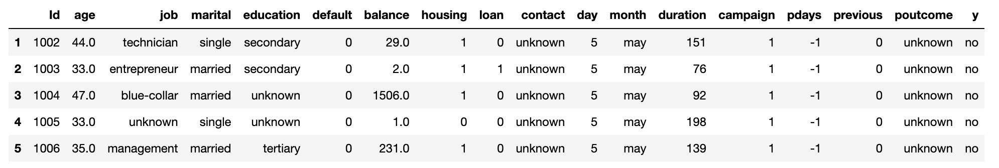

## Exploratory Data Analysis (EDA)

Data pre-processing is a main step in Machine Learning as the useful information which can be derived it from data set directly affects the model quality so it is extremely important to do at least necessary preprocess for our data before feeding it into our model.

In this assignment, we are going to utilize python to develop a predictive machine learning model. First, we will import some important and necessary libraries.

Below we are can see that there are various numerical and categorical columns. The most important column here is y, which is the output variable (desired target): this will tell us if the client subscribed to a term deposit(binary: ‘yes’,’no’).

