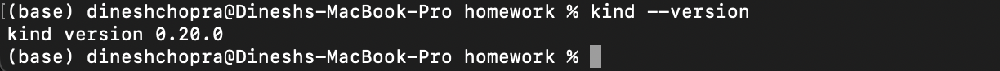
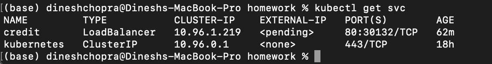
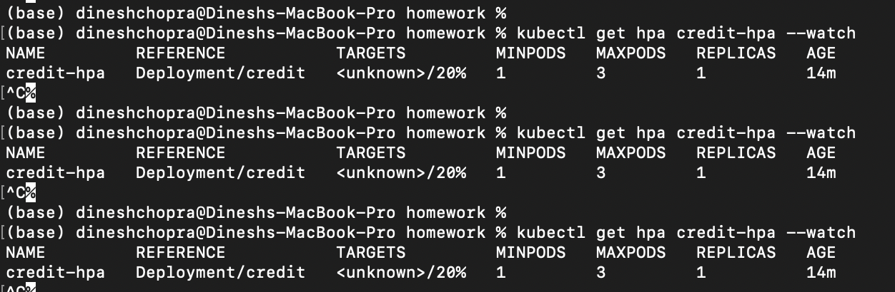

## Question 1:

Here <value> is the probability of getting a credit card. You need to choose the right one.

* 0.3269
* 0.5269
* 0.7269
* 0.9269

> **Output:** `0.7269`

## Question 2
What's the version of kind that you have?

Use kind --version to find out.

> **Output:** `0.20.0`

## Question 3
Now let's test if everything works. Use `kubectl` to get the list of running services.

What's `CLUSTER-IP` of the service that is already running there?

> **Output:** `10.96.0.1`

## Question 4
To be able to use the docker image we previously created (zoomcamp-model:hw10), we need to register it with kind.

What's the command we need to run for that?

* kind create cluster
* kind build node-image
* kind load docker-image
* kubectl apply

> **Output:** `kind load docker-image`

## Question 5
What is the value for `<Port>`?

Apply this deployment using the appropriate command and get a list of running Pods. You can see one running Pod.

> **Output:** `9696`

## Question 6

Fill it in. What do we need to write instead of <???>?

Apply this config file.

> **Output:** `credit`

## Question 7 (optional)
Run kubectl get hpa credit-hpa --watch command to monitor how the autoscaler performs. Within a minute or so, you should see the higher CPU load; and then - more replicas. What was the maximum amount of the replicas during this test?

* 1
* 2
* 3
* 4

> **Output** `1`

